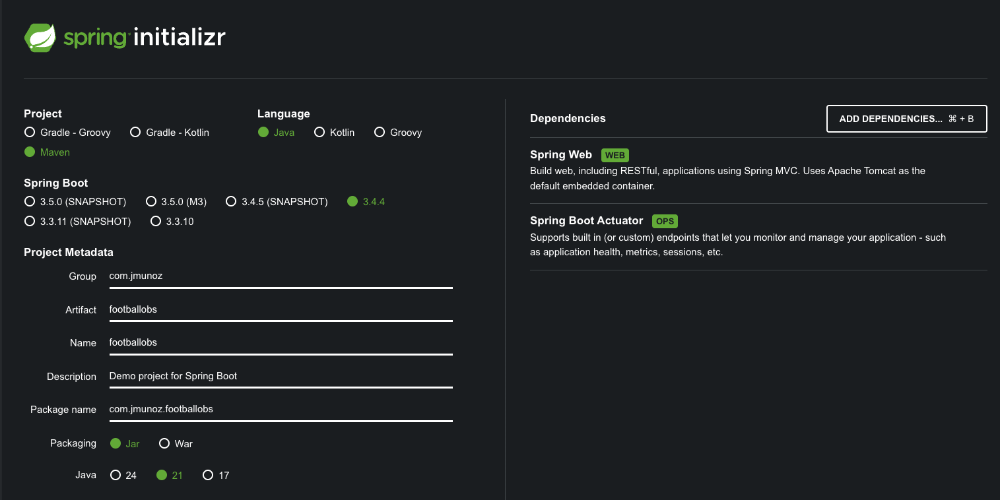

# SPRING BOOT 3 COOKBOOK

## Añadir Actuator a mi aplicación

Uso Spring Initializr: `https://start.spring.io/`

En `applications.yml` he añadido los siguientes endpoints: `health,env,metrics,beans,loggers`.

- /actuator/health: provee información de salud de la aplicación. Muy útil en entornos contenerizados como Kubernetes para asegurar que la aplicación está arriba y ejecutándose
- /actuator/env: devuelve las variables de entorno de la aplicación
- /actuator/metrics: devuelve una lista con las métricas que han sido expuestas por la aplicación. Se puede obtener el valor de una de las métricas añadiendo el nombre de la métrica al endpoint
  - /actuator/metrics/process.cpu.usage
- /actuator/beans: devuelve una lista con los beans registrados en el contenedor IoC, es decir, los beans que pueden inyectarse en otros beans
- /actuator/loggers: devuelve una lista de niveles de log y loggers de la aplicación. Permite modificar el nivel de log en tiempo de ejecución

Para controlar quien accede a los endpoint de Actuator, podríamos proteger los endpoints.

## Ejecución del proyecto

- Clonar/descargar el proyecto
- Ejecutar el proyecto con el comando: `./mvnw spring-boot:run`
    - O ejecutar directamente desde IntelliJ Idea
- Endpoints de Actuator:
  - http://localhost:8080/actuator/health
  - http://localhost:8080/actuator/env
  - http://localhost:8080/actuator/metrics
    - - http://localhost:8080/actuator/metrics/process.cpu.usage  (esta métrica, por ejemplo)
  - http://localhost:8080/actuator/beans
  - http://localhost:8080/actuator/loggers